# Anatomy of a block
This document explores the different parts of a block.

## Connections

Connections define where blocks can connect and what kind of blocks they can connect to.
:::note
The term connection normally refers to a relationship between two things. In Blockly, it usually means connector, like a plug or socket. Thus, when you connect two blocks, you fit their connections together.
:::

There are four types of connections:
| Connection type | Image | 
|-----------|------|
| Output connection ||
| Input connection ||
| Previous connection ||
| Next connection ||

Output connections and input connections can connect together, and next connections and previous connections can connect together. You can further restrict connections with [connection checks](https://developers.google.com/blockly/guides/create-custom-blocks/inputs/connection-checks).

You can [customize the shapes of connections](https://developers.google.com/blockly/guides/create-custom-blocks/renderers/create-custom-renderers/connection-shapes) using a custom renderer.

### Top-level connections
Blocks have three connections whose use is optional.

A block may have a single output connection, represented as a male jigsaw connector on the leading edge of a block. An output connection passes a block's value (expression) to another block. A block with an output connection is called a **value block**.

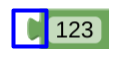

A block may have a previous connection on its top (represented as a notch) and a next connection on its bottom (represented as a tab). These allow blocks to be stacked vertically, representing a sequence of statements. A block without an output connection is called a statement block and usually has both previous and next connections.

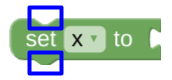

For more information, see [Top-level connections](https://developers.google.com/blockly/guides/create-custom-blocks/define/top-level-connections).

## Fields

**Fields** define the majority of UI elements within a block. These include the string labels, dropdowns, checkboxes, images, and inputs for [literal](https://en.wikipedia.org/wiki/Literal_(computer_programming)) data such as strings and numbers. For example, this loop block uses label fields, a dropdown field, and number fields.

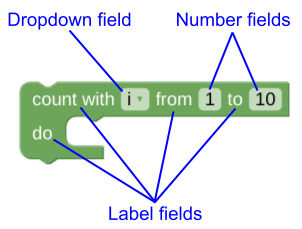

Blockly provides a number of [built-in fields](https://developers.google.com/blockly/guides/create-custom-blocks/fields/built-in-fields/overview), including text inputs, color pickers, and images. You can also [create your own fields](https://developers.google.com/blockly/guides/create-custom-blocks/fields/customizing-fields/overview).

For more information, see [Fields](https://developers.google.com/blockly/guides/create-custom-blocks/fields/overview).

## Inputs

**Inputs** are containers for fields and connections. A block is built by rendering its inputs in one or more rows like bricks.

:::note
The term input has a number of meanings in Blockly. Its most common meaning is the one described here: a container for fields and connections. Less commonly, it means to enter a value or refers to a value that has been entered.
:::

There are four different types of inputs, all of which can contain fields (including labels) and two of which contain a single connection. You can also [create custom inputs](https://developers.google.com/blockly/guides/create-custom-blocks/inputs/creating-custom-inputs), which support [custom rendering](https://developers.google.com/blockly/guides/create-custom-blocks/renderers/overview).

| Input type | Connection type |	Image |
|------------|-----------------|--------|
|Dummy input|None||
|End-of-row input|None|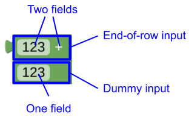|
|Value input|Input connection||
|Statement input|Next connection||

We will introduce these inputs through a series of examples. For information about defining the inputs, connections, and fields that make up a block, see Block structure in JSON and Block structure in JavaScript.

### Dummy inputs

A **dummy** input is just a container for fields -- it does not have a connection. For example, the following number block has a single dummy input that contains a single number field.

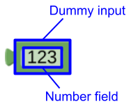

As a more complex example, consider a block that adds two numbers together. This could be built from a single dummy input with three fields (number, label, number):

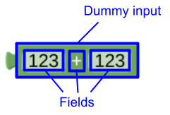

or three dummy inputs, each with a single field:

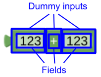

### End-of-row inputs

Blockly uses heuristics to decide whether to render all inputs in a single row or render each input in its own row. If you want to be sure that an input starts a new row, use an **end-of-row input** as the previous input.

Like dummy inputs, end-of-row inputs can contain fields but do not have a connection. For example, here is the addition block built from an end-of-row input with two fields and a dummy input with one field. The end-of-row input forces the dummy input to be rendered in a new row.


### Value inputs

Fields are limited in what they can accept. For example, number fields only accept numbers. But what if you want to add two variables together? Or add the result of a procedure call to the result of a different calculation? To solve this problem, use input connections instead of fields. This allows users to use value blocks as input values.

A **value input** contains zero or more fields and ends in an input connection. The following block replaces the number fields in the addition block with input connections. It is built from two value inputs -- the first does not contain any fields and the second contains a label field. Both end in input connections.

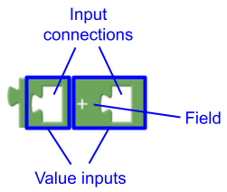

### Statement inputs
The last type of input is a statement input, which contains zero or more fields and ends with a next connection. The next connection lets you nest a stack of statement blocks inside your block. For example, consider the following repeat block. The second row of this block consists of a statement input with a single label field and a next connection.

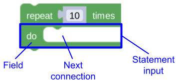

Statement inputs are always rendered in their own row. You can see this in the following if-then-else block, which has a value input in its first row and statement inputs in the next two rows.

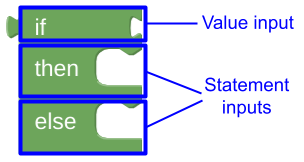

### Inline versus external inputs
Inputs can be rendered inline or externally. This controls whether the connectors for value inputs are rendered inside the block (inline) or on the outside edge (external), as well as whether inputs are rendered in the same or different rows.

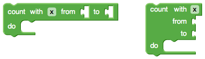     


When you create a custom block, you can specify which to use or let Blockly decide for you. For more information, see [Inline vs. external inputs](https://developers.google.com/blockly/guides/create-custom-blocks/define/inline-vs-external).

### Go play!
The best way to learn about inputs, fields, and connections is to construct blocks in the Blockly Developer Tools and choose different settings for the ```inputs``` dropdown (```automatic```, ```external```, ```inline```).

## Icons
In addition to inputs, connections, and fields, blocks can have one or more **icons**. These have a variety of uses, such as displaying warnings, entering block-level comments, or displaying the mutator UI. For example, here is a block with a comment icon and its associated editor.

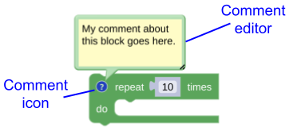

For more information, see [Icons](https://developers.google.com/blockly/guides/create-custom-blocks/icons/overview).

## Blocks and JavaScript objects

Blocks, inputs, connections, fields, and icons are all JavaScript objects.

|Blockly component | Base class| 	Subclasses|
|------------------|-----------|-------------|
|Block |```Block```|```BlockSvg```|
|Input | ```Input```| ```DummyInput```|
|||```EndRowInput```|
|||```ValueInput```|
|||```StatementInput```|
|||custom input|
|Connection| 	```Connection```|	```RenderedConnection```|
|Field| ```	Field```| ```FieldTextInput```|
| | |```FieldNumber```|
| | |```FieldLabel```|
| | |custom field|
| | |	etc.|
|Icon | ```Icon```|```CommentIcon```|
| | | ```MutatorIcon```|
| | |```	WarningIcon```|
| | |custom icon|

The objects in a block form a tree-shaped object. Understanding how the graphical representation of a block corresponds to this tree is helpful when you write code to manipulate blocks programmatically. For example, a controls_for block:

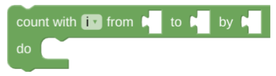

corresponds to the following tree of JavaScript objects.

```bash
// <Object> means an instance of an Object.
{                                   // Block
  nextConnection: <Connection>,     // ConnectionType NEXT_STATEMENT
  outputConnection: null,
  previousConnection: <Connection>, // ConnectionType PREVIOUS_STATEMENT
  inputList: [                      // Array of Inputs in block
    {                               // ValueInput
      connection: <Connection>,     // ConnectionType INPUT_VALUE
      fieldRow: [                   // Array of fields in Input
        <FieldLabel>,               // 'count with'
        <FieldVariable>,            // i
        <FieldLabel>,               // 'from'
      ],
    },
    {                               // ValueInput
      connection: <Connection>,     // ConnectionType INPUT_VALUE
      fieldRow: [
        <FieldLabel>,               // 'to'
      ],
    },
    {                               // ValueInput
      connection: <Connection>,     // ConnectionType INPUT_VALUE
      fieldRow: [
        <FieldLabel>,               // 'by'
      ],
    },
    {                               // StatementInput
      connection: <Connection>,     // ConnectionType NEXT_STATEMENT
      fieldRow: [
        <FieldLabel>,               // 'do'
      ],
    },
  ]
}
```